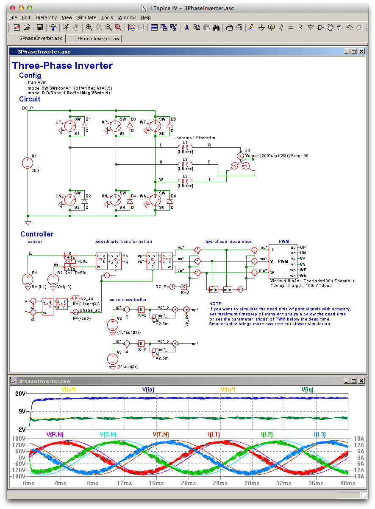

LTspice Control Library
===========================
LTspice Control Library provides a set of control elements, that allow to design a controller of a circuit by drawing
a control block diagram and simulate the circuit and the controller on LTspice IV / XVII.

Installation
==============
1. Install LTspice IV / XVII.
2. Download [LTspice Control Library](https://github.com/kanedahiroshi/LTspiceControlLibrary/archive/master.zip).
3. Unzip the downloaded file and run the script.  
    LTspice IV: Run "LTspiceControlLibrary\install.bat" as Administrator.  
    LTspice XVII: Run "LTspiceControlLibrary\installXVII.bat".  
  This script works as below:
  * Search the installation directory of LTspice IV. (default: LTSPICE_DIR=C:\Program Files\LTC\LTspiceIV)  
    Search the personal directory of LTspice XVII. (default: LTSPICE_DIR=%USERPROFILE%\Documents\LTspiceXVII)
  * Copy "LTspiceControlLibrary\lib\sub\LTspiceControlLibrary" to "%LTSPICE_DIR%\lib\sub\LTspiceControlLibrary".
  * Copy "LTspiceControlLibrary\lib\sym\LTspiceControlLibrary" to "%LTSPICE_DIR%\lib\sym\LTspiceControlLibrary".
4. Restart LTspice IV / XVII. The library should be now usable.
5. Try examples in "LTspiceControlLibrary\examples" to confirm installation and learn how to use this library.

More Information
===========================
- List of [Control Elements](ControlElements.md)
- LTspice Control Library is released under the [MIT License](LICENSE.txt)
- [DCモータ制御 紹介記事用サンプル](examples/Introduction/201310Toragi)
- [DCブラシレスモータ制御 紹介記事用サンプル](examples/Introduction/201404Interface)
- [太陽電池　最大電力点追従制御 紹介記事用サンプル](examples/Introduction/201705Toragi)
