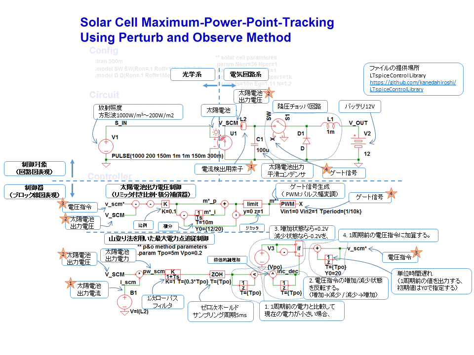

# 太陽電池　最大電力点追従制御 紹介記事用サンプル

## このサンプルについて
このサンプルは以下の記事で使用したものです。

```
金田洋志
出力最大の条件探し!　太陽電池と専用電源MPPT
トランジスタ技術 2017年5月号 pp.111-114. CQ出版
```

サンプルは[LTspiceControlLibrary/examples/SolarCell](../../SolarCell)にあります。
1. SolarCellMPPTUsingP&OMethod_Buck.asc （図2, 4で使用、山登り法を使用した太陽電池の最大電力点追従制御）
2. SolarCells.asc （図3で使用、太陽電池モデル）
3. SolarCellIVCurve.asc （図5で使用、太陽電池のI-V特性）
4. SolarCellMPPTUsingP&OMethod_Boost.asc （リスト1の降圧チョッパを昇圧チョッパに変更したもの）
5. SolarCellMPPTUsingP&OMethod_Buck(Switchless).asc （リスト1の降圧チョッパを可変DCトランスで近似して解析速度を速めたもの）
6. SolarCellMPPTUsingP&OMethod_Boost(Switchless).asc （リスト4の昇圧チョッパを可変DCトランスで近似して解析速度を速めたもの）

リスト1～3が記事で使用したものです。リスト4～6は記事では使用していません。
  
リスト１のシミュレーション回路に説明を記載した図です。詳細は記事を参照してください。


## 外部リンク
- [トランジスタ技術2017年5月号（CQ出版WEBサイト）](http://toragi.cqpub.co.jp/tabid/825/Default.aspx)
- [記事1ページ目（CQ出版WEBサイト）](http://toragi.cqpub.co.jp/Portals/0/backnumber/2017/05/p111.pdf)
